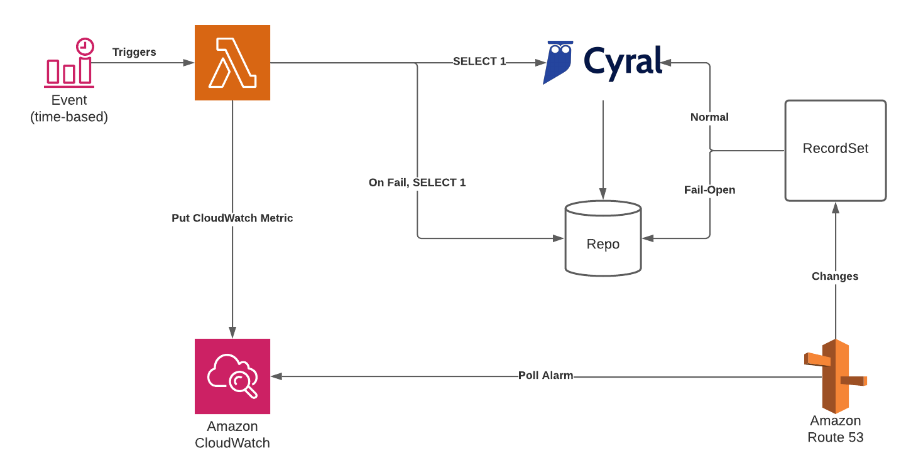

# CloudFormation template for sidecar DNS Fail-Open

This is a template that creates a DNS Fail-Open system, utilizing a Lambda function, CloudWatch alarms and Route53 health-checks to
switch a DNS recordset between a sidecar and a repo, considering the current status of the sidecar.

The overrall design is based on an event that triggers on a specific interval, which performs the healthcheck and activates
an alarm in case the sidecar is failing. The architecture is described in the chart below:

The lambda that is used is in [its own repo](https://github.com/cyralinc/health-check-aws).

The architecture is based on AWS’ own way of liveness probing resources in private subnets, which can be found in [this link](https://aws.amazon.com/blogs/networking-and-content-delivery/performing-route-53-health-checks-on-private-resources-in-a-vpc-with-aws-lambda-and-amazon-cloudwatch/).
Their architecture emulates the possibilities for Route53 health checks with the lambda acting as a bridge between the health-check that can only monitor publicly named resources and the sidecar that is contained in a private subnet.

## Deployment

### Pre-Requisites
- The hosted zone that will be used to create the RecordSets

- A subnet for the lambda function with access to CloudWatch and SecretsManager.

- An ECR to store the lambda function that needs to be either public or in the same region as the lambda.

### Configuration

The template asks for sidecar configuration, such as its FQDN and the port that will be checked.

The DB configuration is based on environment variables and asks for the username, password and database for the native credentials on the repo. These values can be changed to be retrieved from secrets, which would be an improvement if necessary.

The lambda configuration needs its VPC and subnets. Keep in mind that the subnet/VPC needs to be the in the same VPC as the sidecar, and the VPC needs to attend to the second pre-requisite of having access to outbound internet.

| Variable                      | Description                                                                                                                                                                                             |
| ---                           | ---                                                                                                                                                                                                     |
| SidecarAddress                | Domain name of the sidecar load balancer.                                                                                                                                                               |
| SidecarNamePrefix             | Name prefix of the sidecar. This parameter is used to identify the elements of this stack and also the events created during runtime.                                                                   |
| SidecarPort                   | Port allocated on the sidecar for this repository.                                                                                                                                                      |
| RepoSecretsLocation           | Location in AWS Secrets Manager that stores the secret containing the repository credentials. The secret must be in the same region as the lambda function.                                             |
| RepoAddress                   | CNAME or IP address used to access the repository.                                                                                                                                                      |
| RepoPort                      | The port that the repository is listening on                                                                                                                                                            |
| RepoDatabase                  | The database on the repository that the healthcheck will connect to.                                                                                                                                    |
| VPC                           | The VPC the lambda will be attached to.                                                                                                                                                                 |
| Subnets                       | The subnets the lambda will be deployed to. All subnets must be able to reach both the sidecar and the repository. These subnets must also support communication with `CloudWatch` and `SecretsManager` |
| ImageUri                      | URI of a container image in the Amazon ECR registry that contains the health check lambda.                                                                                                              |
| NumberOfRetries               | Number of failed consecutive health check attempts before the lambda sets the metric as unhealthy.                                                                                                      |
| ConsecutiveFailuresForTrigger | Number of times the healthcheck must fail in a row to trigger the alarm and the failover. This will increase the total time the sidecar needs to be down before the fail over triggers.                 |
| HostedZoneID                  | Hosted zone where the failover record sets will be created.                                                                                                                                             |
| RecordSetName                 | Name of the record sets that will reference the repository and sidecar.                                                                                                                                 |
| RepoRecordSetType             | Type of the record set for the repository informed in 'RepoAddress'. If a domain name was provided, then choose 'CNAME', if IPv4 choose 'A' and if IPv6 choose 'AAAA'.                                  |
| TTL                           | Time-to-live for the record set (in seconds).                                                                                                                                                           |
