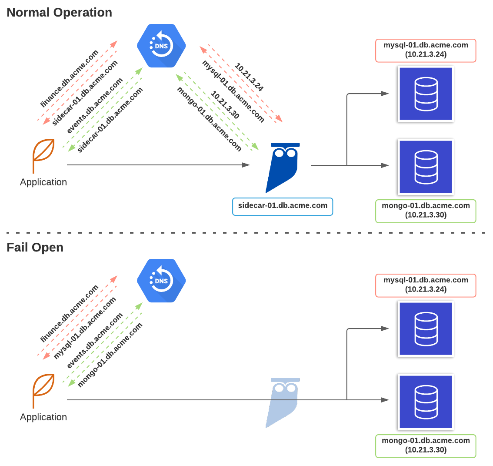

# CloudFormation Template for Cyral Sidecar DNS Fail Open for AWS

## Introduction

This repository contains the CloudFormation template that deploys the Cyral Sidecar Fail Open feature.
This feature provides automatic fail open/close to a Cyral Sidecar and its respectives target databases,
allowing customers to keep existing databases reachable even when Cyral Sidecar experience transient
failures.

The Cyral Sidecar Fail Open for AWS is built on top of CloudWatch, Lambda and Route53. The CloudFormation 
template contained here deploys the whole infrastructure and will provide the fail open feature out of
the box.

The overrall design is based on an event that triggers on a specific interval and perform health checks.
In case health checks fail, an alarm will be raised which will then trigger the change in the DNS record.
The architecture is based on AWS' own way of liveness probing resources in private subnets, which can be 
found [here](https://aws.amazon.com/blogs/networking-and-content-delivery/performing-route-53-health-checks-on-private-resources-in-a-vpc-with-aws-lambda-and-amazon-cloudwatch/).
Our architecture is described in the image below:

The lambda function lives in [its own repo](https://github.com/cyralinc/health-check-aws).

# Limitations

Some limitations apply to the operation of the fail open as follows:

## DNS CNAME

One CNAME must be used per Cyral Sidecar and per repository. It means that if two different 
repositories are bound to the same Cyral Sidecar, then one CNAME must be created to represent
each repository. This will allow separate health checks as Cyral Sidecar is designed as a
modular architecture and support for different databases are completely independent at
Sidecar level.

## Credentials

Only repositories that are bind to Cyral Sidecars and that accept native credentials are supported.
This means that repositories that use SSO credentials exclusively are **not supported**. This 
limitation is due to the fact that the same credentials used to check if the Cyral Sidecar is
healthy are also used to check if the database is healthy, so native database credentials are 
required.

## Deployment

One health check must be deployed [per CNAME](#(One CNAME per Cyral Sidecar per repository)), thus
one lambda will be deployed for each pair Sidecar CNAME + Repository CNAME.

# Stack Deployment

TODO: review
### Pre-Requisites
- The hosted zone that will be used to create the RecordSets

- A subnet for the lambda function with access to CloudWatch and SecretsManager.

- An ECR to store the lambda function that needs to be either public or in the same region as the lambda.

### Configuration

The template asks for sidecar configuration, such as its FQDN and the port that will be checked.

The DB configuration is based on environment variables and asks for the username, password and database for the native credentials on the repo. These values can be changed to be retrieved from secrets, which would be an improvement if necessary.

The lambda configuration needs its VPC and subnets. Keep in mind that the subnet/VPC needs to be the in the same VPC as the sidecar, and the VPC needs to attend to the second pre-requisite of having access to outbound internet.

| Variable                      | Description                                                                                                                                                                                             |
| ---                           | ---                                                                                                                                                                                                     |
| SidecarAddress                | Domain name of the sidecar load balancer.                                                                                                                                                               |
| SidecarNamePrefix             | Name prefix of the sidecar. This parameter is used to identify the elements of this stack and also the events created during runtime.                                                                   |
| SidecarPort                   | Port allocated on the sidecar for this repository.                                                                                                                                                      |
| RepoSecretsLocation           | Location in AWS Secrets Manager that stores the secret containing the repository credentials. The secret must be in the same region as the lambda function.                                             |
| RepoAddress                   | CNAME or IP address used to access the repository.                                                                                                                                                      |
| RepoPort                      | The port that the repository is listening on                                                                                                                                                            |
| RepoDatabase                  | The database on the repository that the healthcheck will connect to.                                                                                                                                    |
| VPC                           | The VPC the lambda will be attached to.                                                                                                                                                                 |
| Subnets                       | The subnets the lambda will be deployed to. All subnets must be able to reach both the sidecar and the repository. These subnets must also support communication with `CloudWatch` and `SecretsManager` |
| ImageUri                      | URI of a container image in the Amazon ECR registry that contains the health check lambda.                                                                                                              |
| NumberOfRetries               | Number of failed consecutive health check attempts before the lambda sets the metric as unhealthy.                                                                                                      |
| ConsecutiveFailuresForTrigger | Number of times the healthcheck must fail in a row to trigger the alarm and the failover. This will increase the total time the sidecar needs to be down before the fail over triggers.                 |
| HostedZoneID                  | Hosted zone where the failover record sets will be created.                                                                                                                                             |
| RecordSetName                 | Name of the record sets that will reference the repository and sidecar.                                                                                                                                 |
| RepoRecordSetType             | Type of the record set for the repository informed in 'RepoAddress'. If a domain name was provided, then choose 'CNAME', if IPv4 choose 'A' and if IPv6 choose 'AAAA'.                                  |
| TTL                           | Time-to-live for the record set (in seconds).                                                                                                                                                           |
