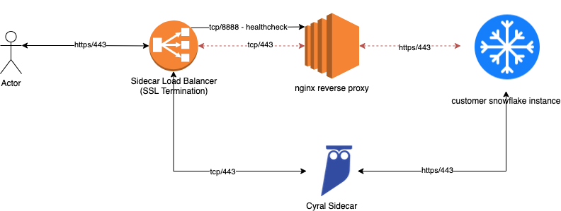
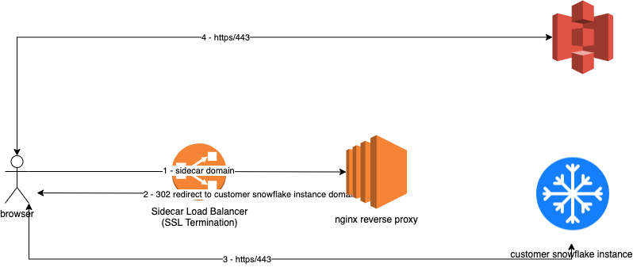

# Cyral sidecar fail-open for Snowflake

## Introduction

The [CloudFormation Template](../templates/cft_sidecar_failopen.yaml) that deploys the Cyral sidecar fail-open feature
also supports Snowflake. It provides automatic fail-open/fail-closed operation for a Cyral sidecar Snowflake repository,
allowing customers to keep Snowflake reachable even when the Cyral sidecar experiences transient failures.

In the current version, the nginx reverse proxy is configured with two hostnames:

 - sidecar_hostname.domain
 - snowflake_account_name.domain

The load balancer is configured for SSL termination and a certificate for both domains. During normal operation, the
sidecar’s port 443 Listener forwards to the sidecar.

During a fail open scenario, the 443 Listener on the load balancer sends traffic to the nginx reverse proxy while issuing
302 redirects for regular users due to CORS errors for requests that must be sent through S3 (large query result sets and
some snowflake browser UI resources). Users using snowsql or other clients that don’t handle CORS related headers would
be proxied through the nginx instance.

# Limitations

Some limitations apply to the operation of the fail-open feature for Snowflake, as described below.

## Native credentials required for BI tools connecting to Snowflake
At this time, SSO-based authentication between BI tools such as Looker and Tableau are not supported.

## Sidecar port
In order to use the fail-open feature, the sidecar port must match the original repository port used in direct connections.
In other words, it means that the Snowflake repository mapped in Cyral control plane must be bound to the sidecar using 
port `443`. This will make sure that users connecting to the sidecar using `sidecar.mycompany.com:443` will keep using the
same port when the underlying address of this CNAME points directly to Snowflake during fail-open.

# Stack deployment

You only need to deploy the [CloudFormation Template](../templates/cft_sidecar_failopen.yaml) to get the instance online. The below table should help 
provide guidance on the values that should be used for each CFT Parameter.

| CFT Parameter                                   | Description                                                                                                                                                                                                                                                                                                                        | Example                                                       |
|-------------------------------------------------|------------------------------------------------------------------------------------------------------------------------------------------------------------------------------------------------------------------------------------------------------------------------------------------------------------------------------------|---------------------------------------------------------------|
| RepoHost                                        | This should be the full URL the customer uses to access their snowflake account.                                                                                                                                                                                                                                                   | xx#####.snowflakecomputing.com                                |
| SidecarDomainName                               | This should be the high level domain name associated with the sidecar. This will be used to create a reverse proxy entry of the form SnowflakeAccountName.SidecarDomainName that reverse proxies to RepoHost                                                                                                                       | aws.mydomain.us                                               |
| SidecarHost                                     | This should be the same full DNS hostname used by the currently deployed sidecar. This will be used to create a virtual host entry in nginx for this domain to reverse proxy connections to the RepoHost                                                                                                                           | sidecar.aws.mydomain.us                                       |
| SidecarNamePrefix                               | This parameter is used to identify the elements of this stack and also the events created during runtime and should match the prefix of the sidecar                                                                                                                                                                                | cyral-xyz123                                                  |
| SnowflakeAccountName                            | This should just be the account name for the customer’s snowflake instance                                                                                                                                                                                                                                                         | xx#####                                                       |
| SnowflakeNGINXProxyAmiId                        | This is the AWS Image that will be used to deploy the instance. There should be no need to replace this. One thing to note is that if a Debian based OS Image is used, this deployment will fail since it makes use of the yum command and assumes installation locations for nginx that are specific to non Debian installations. | /aws/service/ami-amazon-linux-latest/amzn2-ami-hvm-x86_64-gp2 |
| SnowflakeNGINXProxyAsgDesired                   | The number of instances that you would like running                                                                                                                                                                                                                                                                                | 1                                                             |
| SnowflakeNGINXProxyAsgMin                       | This should be set to the minimum number of instances allowed within the ASG                                                                                                                                                                                                                                                       | 1                                                             |
| SnowflakeNGINXProxyAsgMax                       | This should be set to the maximum number of instances allowed within the ASG                                                                                                                                                                                                                                                       | 2                                                             |
| SnowflakeNGINXProxyInstanceSecurityGroup        | Any security groups that should be assigned to the EC2 instance. Note that at least tcp/8888 should be allowed from the load balancer and tcp/443 from anywhere to the instance(s)                                                                                                                                                 | Allow-HTTP-HTTPS                                              |
| SnowflakeNGINXProxyLoadBalancerScheme           | The load balancer scheme: 'internal' or 'internet-facing'                                                                                                                                                                                                                                                                          | internal                                                      |
| SnowflakeNGINXProxyEnableCrossZoneLoadBalancing | Enables cross zone load balancing in for higher availability in case multiple subnets in different AZs are provided.                                                                                                                                                                                                               | true                                                          |
| SnowflakeNGINXProxyInstanceType                 | The size EC2 instance that should be deployed                                                                                                                                                                                                                                                                                      | t2.medium                                                     |
| SnowflakeNGINXProxySSHKeyName                   | This should be the name of the SSH Key that should be assigned to the created instances                                                                                                                                                                                                                                            | AWS_SSH_Key                                                   |
| SnowflakeNGINXProxySubnets                      | This should be the same subnet(s) where the Cyral sidecar belongs                                                                                                                                                                                                                                                                  | subnet-000XXX                                                 |

## Sidecar Load Balancer (Optional)
In addition to the sidecar load balancers existing certificates, an additional certificate for
`<snowflake_account_name>.customer.sidecar.domain` is required for customers that will be using some BI tools like Tableau
to connect through the fail open reverse proxy. For those customers, complete these configuration steps to generate a new
certificate for this domain name to be added to the sidecar load balancer.

### Configuration Steps

1. Open the AWS Certificate Manager
2. Create a new certificate for `<snowflake_account_name>.customer.sidecar.domain`
3. Once the certificate is validated, open the AWS EC2 console
4. Locate the Cyral sidecar load balancer that hosts your snowflake instance(s)
5. Click the `view/edit certificates` next to the 443 Listener on the load balancer
6. Click the `+` sign at the top of the page to add another certificate
7. Locate the certificate created in step 2 and place a check next to it
8. Click the `Add` button to add the certificate 
