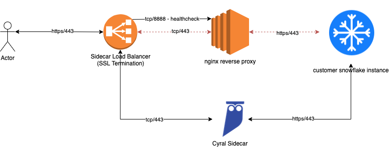
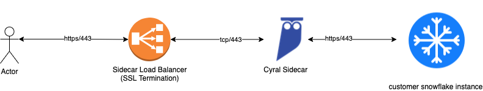
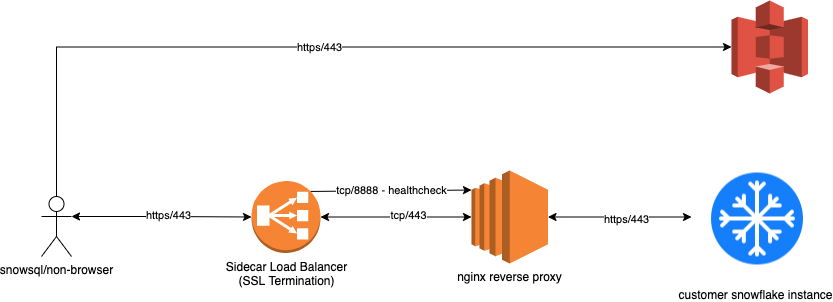
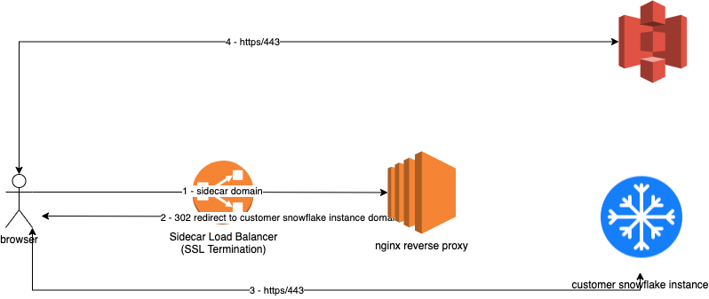

# CloudFormation template for Cyral sidecar fail-open for AWS (snowflake repos)

## Introduction

This repository contains the CloudFormation template that deploys the Cyral sidecar fail-open feature for snowflake repos.
This feature provides manual fail-open/fail-closed operation for a Cyral sidecar snowflake repository,
allowing customers to keep existing databases reachable even when the Cyral sidecar experiences transient
failures.

In the current version, the nginx reverse proxy is configured with two hostnames:

 - sidecar_hostname.domain
 - snowflake_account_name.domain

The load balancer is configured for SSL termination and a certificate for both domains. During normal operation, the
sidecar’s port 443 Listener forwards to the sidecar.

During a fail open scenario, the 443 Listener on the load balancer sends traffic to the nginx reverse proxy while issuing
302 redirects for regular users due to CORS errors for requests that must be sent through S3 (large query result sets and
some snowflake browser UI resources). Users using snowsql or other clients that don’t handle CORS related headers would
be proxied through the nginx instance.

# Limitations

Some limitations apply to the operation of the fail-open feature, as described below.

## Native credentials required for BI tools connecting to Snowflake
At this time, we do not support SSO based authentication between BI tools such as Looker and Tableau and Snowflake through
the fail open nginx reverse proxy.

# Configuration

## Nginx Reverse Proxy
The nginx instance(s) is/are deployed as EC2 instances managed by an ASG for scaling purposes. The nginx default_server
has been configured to run on port 8888 so that the load balancer can perform healthchecks against the EC2 server. If
8888 is online, then nginx is up and therefore the server should be ready to handle requests. In addition to listening on
port 8888, all reverse proxy traffic listens on port 443.

### Configuration Steps
You only need to deploy via CFT to get the instance online. The below table should help provide guidance on the values that
should be used for each CFT Parameter.

| CFT Parameter         | Description                                                                                                                                                                                                                                                                                                                        | Example                                                       |
|-----------------------|------------------------------------------------------------------------------------------------------------------------------------------------------------------------------------------------------------------------------------------------------------------------------------------------------------------------------------|---------------------------------------------------------------|
| AmiId                 | This is the AWS Image that will be used to deploy the instance. There should be no need to replace this. One thing to note is that if a Debian based OS Image is used, this deployment will fail since it makes use of the yum command and assumes installation locations for nginx that are specific to non Debian installations. | /aws/service/ami-amazon-linux-latest/amzn2-ami-hvm-x86_64-gp2 |
| AsgDesired            | The number of instances that you would like running                                                                                                                                                                                                                                                                                | 1                                                             |
| AsgMax                | This should be set to the maximum number of instances allowed within the ASG                                                                                                                                                                                                                                                       | 2                                                             |
| AsgMin                | This should be set to the minimum number of instances allowed within the ASG                                                                                                                                                                                                                                                       | 1                                                             |
| InstanceSecurityGroup | Any security groups that should be assigned to the EC2 instance. Note that at least tcp/8888 should be allowed from the load balancer and tcp/443 from anywhere to the instance(s)                                                                                                                                                 | Allow-HTTP-HTTPS                                              |
| InstanceType          | The size EC2 instance that should be deployed                                                                                                                                                                                                                                                                                      | t2.medium                                                     |
| RepoHost              | This should be the full URL the customer uses to access their snowflake account.                                                                                                                                                                                                                                                   | xx#####.snowflakecomputing.com                                |
| SSHKeyName            | This should be the name of the SSH Key that should be assigned to the created instances                                                                                                                                                                                                                                            | AWS_SSH_Key                                                   |
| SideCarDomainName     | This should be the high level domain name associated with the sidecar. This will be used to create a reverse proxy entry of the form SnowFlakeAccountName.SideCarDomainName that reverse proxies to RepoHost                                                                                                                       | aws.mydomain.us                                               |
| SidecarHost           | This should be the same full DNS hostname used by the currently deployed sidecar. This will be used to create a virtual host entry in nginx for this domain to reverse proxy connections to the RepoHost                                                                                                                           | sidecar.aws.mydomain.us                                       |
| SidecarNamePrefix     | This parameter is used to identify the elements of this stack and also the events created during runtime and should match the prefix of the sidecar                                                                                                                                                                                | cyral-xyz123                                                  |
| SnowFlakeAccountName  | This should just be the account name for the customer’s snowflake instance                                                                                                                                                                                                                                                         | xx#####                                                       |
| Subnets               | This should be the same subnet(s) where the Cyral sidecar belongs                                                                                                                                                                                                                                                                  | subnet-000XXX                                                 |

## Sidecar Load Balancer (Optional)
In addition to the sidecar load balancers existing certificates, an additional certificate for
`<snowflake_account_name>.customer.sidecar.domain` is required for customers that will be using some BI tools like Tableau
to connect through the fail open reverse proxy. For those customers, complete these configuration steps to generate a new
certificate for this domain name to be added to the sidecar load balancer.

### Configuration Steps

1. Open the AWS Certificate Manager
2. Create a new certificate for `<snowflake_account_name>.customer.sidecar.domain`
3. Once the certificate is validated, open the AWS EC2 console
4. Locate the Cyral sidecar load balancer that hosts your snowflake instance(s)
5. Click the `view/edit certificates` next to the 443 Listener on the load balancer
6. Click the `+` sign at the top of the page to add another certificate
7. Locate the certificate created in step 2 and place a check next to it
8. Click the `Add` button to add the certificate 

# Failing Open or Closed

##Failing Open

In order to fail open and send traffic through the reverse proxy, complete the following steps:

1. Open the AWS EC2 console
2. Locate the cyral sidecar loadbalancer
3. Edit the target group associated with the 443 Listener on the load balancer
4. Click the `Register Targets` button and locate the EC2 instance(s) for the nginx reverse proxy
5. Place a check next to the EC2 instance(s) for the nginx reverse proxy
6. Click the `Include as pending` below button
7. Click the `Register pending targets` button
8. Now place a check next to the sidecar instance(s) in the registered targets list
9. Click the `Deregister button`

This will take about 0 - 90 seconds for the load balancer to register the changes.

## Going back to the sidecar

In order to move traffic back onto the sidecar, you would perform the same steps as Failing Open.
The only difference is that you will be registering the sidecar instance(s) and deregistering the nginx
reverse proxy instance(s).
